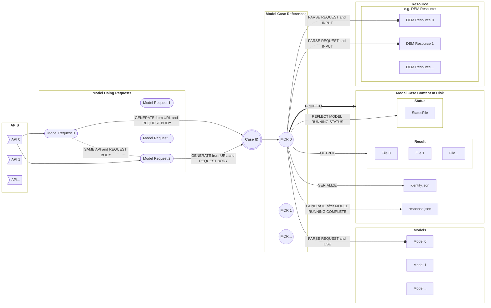

# self-bootstrapping-model-service (SBMS)
A parallelizable framework designed for the execution of complex geographical model services on a single backend machine. **SBMS** leverages implicit and self-organizing relationships, avoiding the need for a pre-defined global DAG, by dynamically coordinating model execution through local node dependencies and state-driven control.

To bridge the model using requests，the model scheduling and the calculated resource, a core class named **Model Case Reference (MCR)** is designed and applied. The instance of this class can transfer a model using request and its related runtime-dependent parameters (usually found in the request body) from the web-server layer to a specific model case folder. Consequently, any requests using the same model with the same parameters can be directed to the same model running case.



**NOTE**

The basic condition for MCR to be **EFFECTIVE** is that when the model and parameters have not changed, the results of multiple runs are **COMPLETELY CONSISTENT**.

## Launch server

- Dependencies:
  
```
    FastAPI
    Portalocker
```

- Run: 
  
```
    python "run.py"
```
